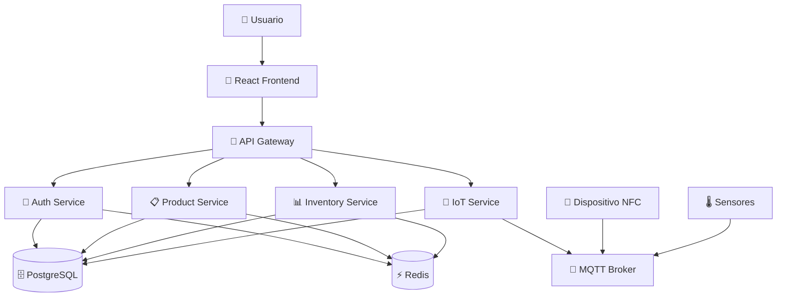

# 🏭 Sistema de Inventario con Microservicios e IoT

[](https://github.com/ComSocUPC/PL-INV/actions/workflows/ci-cd.yml)
[](https://opensource.org/licenses/MIT)
[](https://nodejs.org/)
[](https://www.docker.com/)

Este proyecto implementa un **sistema completo de inventario de productos** utilizando **arquitectura de microservicios**, **integración IoT** (acceso NFC) y **Docker Compose** para facilitar el despliegue. Incluye un **proyecto educativo completo** para aprender microservicios paso a paso.

## 🎯 ¿Nuevo en Microservicios?

Si vienes de un entorno de **arquitectura de 3 capas** (Frontend → Backend → Database), este proyecto te ayudará a entender y migrar a **microservicios** de forma gradual y didáctica.

### 🎓 **Para Estudiantes - Empezar Aquí:**
👉 **[Proyecto Educativo Simple →](./example-simple-warehouse/README.md)**

### � **Para Desarrolladores - Proyecto Completo:**
👉 **[Guía de Inicio Rápido →](./QUICK_START.md)**

## 🏗️ Estructura Simplificada para Principiantes

```
📁 1-frontend/          🎨 CAPA DE PRESENTACIÓN
   └── React App + Dockerfile

📁 2-backend/           ⚙️ CAPA DE LÓGICA (MICROSERVICIOS)
   ├── api-gateway/     📡 Punto de entrada único
   ├── auth-service/    🔐 Autenticación y usuarios  
   ├── product-service/ 📋 Gestión de productos
   ├── inventory-service/ 📊 Control de inventario
   └── iot-service/     🔌 Dispositivos IoT (NFC)

📁 3-database/          💾 CAPA DE DATOS
   ├── postgres/        🗄️ Base de datos principal
   ├── redis/          ⚡ Cache y sesiones
   └── mqtt/           📡 Broker para IoT
```

## 🚀 Inicio Rápido

```bash
# 1. Clonar el proyecto
git clone <tu-repositorio>
cd COMSOC

# 2. Levantar todo el sistema
docker-compose up --build

# 3. Acceder a la aplicación
# Frontend: http://localhost:3005
# API: http://localhost:3000
```

## 🌟 Características

### 🏢 Arquitectura de Microservicios
- **API Gateway**: Punto de entrada único
- **Servicios independientes**: Auth, Products, Inventory, IoT
- **Comunicación asíncrona**: MQTT, Redis
- **Escalabilidad horizontal**: Cada servicio puede escalarse independientemente

### 🔌 Integración IoT
- **Acceso NFC**: Para identificación de productos
- **Sensores**: Monitoreo en tiempo real
- **MQTT Broker**: Comunicación con dispositivos
- **Dashboard IoT**: Visualización de datos de sensores

### � Docker & DevOps
- **Docker Compose**: Orquestación completa
- **Dockerfiles**: Containers optimizados
- **Multi-stage builds**: Imágenes ligeras
- **Health checks**: Monitoreo automático

### 📋 Estándares y Buenas Prácticas
- **OpenAPI 3.0**: Documentación automática de APIs
- **Contract Testing**: Con Pact
- **CI/CD**: GitHub Actions
- **ESLint & Prettier**: Código consistente
- **Conventional Commits**: Historial limpio

## 🛠️ Tecnologías

| Categoría | Tecnologías |
|-----------|-------------|
| **Frontend** | React, Material-UI, Axios |
| **Backend** | Node.js, Express, JWT |
| **Base de Datos** | PostgreSQL, Redis |
| **IoT** | MQTT (Mosquitto), WebSockets |
| **DevOps** | Docker, Docker Compose |
| **Testing** | Jest, Cypress, Pact |
| **CI/CD** | GitHub Actions |

## 📊 Flujo de Datos



## � Documentación

### Para Principiantes
- **[🚀 Guía de Inicio Rápido](./QUICK_START.md)** - Empieza aquí en 10 minutos
- **[🏗️ Guía de Arquitectura](./docs/ARCHITECTURE_GUIDE.md)** - De 3 capas a microservicios
- **[📁 Estructura del Proyecto](./docs/PROJECT_STRUCTURE.md)** - Entiende la organización

### Para Desarrolladores
- **[💻 Guía de Desarrollo](./docs/DEVELOPMENT_GUIDE.md)** - Configuración y flujo de trabajo
- **[🔗 Contratos de API](./docs/API_CONTRACT_GUIDE.md)** - OpenAPI y testing
- **[🚀 Guía de Despliegue](./docs/DEPLOYMENT_GUIDE.md)** - Producción y CI/CD

### Para DevOps
- **[🐳 Docker Guide](./docs/DOCKER_GUIDE.md)** - Containers y orquestación
- **[🔧 Configuración](./docs/CONFIGURATION_GUIDE.md)** - Variables de entorno
- **[📡 IoT Setup](./docs/IOT_GUIDE.md)** - Dispositivos y MQTT

## 🔗 URLs de Desarrollo

| Servicio | URL | Puerto | Descripción |
|----------|-----|--------|-------------|
| Frontend | http://localhost:3005 | 3005 | Interfaz de usuario |
| API Gateway | http://localhost:3000 | 3000 | Punto de entrada |
| Auth Service | http://localhost:3001 | 3001 | Autenticación |
| Product Service | http://localhost:3002 | 3002 | Gestión de productos |
| Inventory Service | http://localhost:3003 | 3003 | Control de inventario |
| IoT Service | http://localhost:3004 | 3004 | Dispositivos IoT |

## 🧪 Testing

```bash
# Tests unitarios
npm test

# Tests de integración
npm run test:integration

# Tests E2E
npm run test:e2e

# Contract testing
npm run test:contracts
```

## � Comandos Útiles

```bash
# Desarrollo
docker-compose up --build          # Levantar todo
docker-compose logs -f auth-service # Ver logs específicos
docker-compose restart product-service # Reiniciar servicio

# Base de datos
docker-compose exec postgres psql -U admin -d inventory_db
docker-compose exec redis redis-cli

# Limpieza
docker-compose down -v             # Parar y limpiar volúmenes
docker system prune -a             # Limpiar Docker completamente
```

## 🤝 Contribuir

1. Fork el proyecto
2. Crear una rama (`git checkout -b feature/AmazingFeature`)
3. Commit cambios (`git commit -m 'Add some AmazingFeature'`)
4. Push a la rama (`git push origin feature/AmazingFeature`)
5. Abrir un Pull Request

## � Convenciones

- **Commits**: Seguimos [Conventional Commits](https://www.conventionalcommits.org/)
- **Código**: ESLint + Prettier configurados
- **APIs**: OpenAPI 3.0 para documentación
- **Testing**: Jest para unit tests, Cypress para E2E

## 📄 Licencia

Este proyecto está bajo la Licencia MIT - ver el archivo [LICENSE](LICENSE) para detalles.

## 🆘 Soporte

- **Issues**: [GitHub Issues](../../issues)
- **Documentación**: Carpeta `./docs/`
- **Guías**: Empezar con `QUICK_START.md`

---

**¿Primera vez con microservicios?** 👆 Empieza con la [Guía de Inicio Rápido](./QUICK_START.md)
