# Guía de Contratos API - OpenAPI y Mejores Prácticas

## 📋 Índice

1. [Design-First Development](#design-first-development)
2. [Estándares OpenAPI](#estándares-openapi)
3. [Templates de Contratos](#templates-de-contratos)
4. [Versionado de APIs](#versionado-de-apis)
5. [Contract Testing](#contract-testing)
6. [Herramientas y Validación](#herramientas-y-validación)
7. [Proceso de Revisión](#proceso-de-revisión)

## 🎯 Design-First Development

### Proceso de Desarrollo

```mermaid
graph TD
    A[Análisis de Requisitos] --> B[Diseño de API]
    B --> C[Especificación OpenAPI]
    C --> D[Revisión de Equipo]
    D --> E{Aprobado?}
    E -->|No| B
    E -->|Sí| F[Generación de Código]
    F --> G[Implementación]
    G --> H[Testing vs Contrato]
    H --> I[Documentación]
```



### Beneficios del Design-First

1. **Comunicación Clara**: El contrato sirve como documentación viva
2. **Desarrollo Paralelo**: Frontend y Backend pueden trabajar independientemente
3. **Detección Temprana**: Problemas de diseño se identifican antes de implementar
4. **Consistencia**: Estándares uniformes en todas las APIs
5. **Testing Automatizado**: Validación automática contra el contrato

## 📋 Estándares OpenAPI

### Estructura Obligatoria

Todo archivo OpenAPI debe incluir:

```yaml
openapi: 3.0.3
info:
  title: "[Servicio] API"
  description: |
    # Descripción del Servicio
    
    Explicación detallada del propósito, responsabilidades y casos de uso.
    
    ## Autenticación
    Descripción del método de autenticación utilizado.
    
    ## Rate Limiting
    Límites de velocidad aplicados.
    
    ## Errores Comunes
    Lista de errores frecuentes y sus soluciones.
    
  version: "1.0.0"
  contact:
    name: "Equipo Responsable"
    email: "team@company.com"
    url: "https://wiki.company.com/team"
  license:
    name: "MIT"
    url: "https://opensource.org/licenses/MIT"

servers:
  - url: http://localhost:3001
    description: Desarrollo local
  - url: https://api-dev.company.com
    description: Desarrollo
  - url: https://api-staging.company.com
    description: Staging
  - url: https://api.company.com
    description: Producción

security:
  - bearerAuth: []

tags:
  - name: "Categoría Principal"
    description: "Descripción de la categoría"
    externalDocs:
      description: "Documentación adicional"
      url: "https://docs.company.com/categoria"
```

### Naming Conventions

#### Paths
```yaml
# ✅ Correcto - kebab-case, sustantivos en plural
/api/products
/api/inventory-movements
/api/product-categories

# ❌ Incorrecto
/api/getProducts
/api/product
/api/ProductCategories
```

#### Parameters
```yaml
# ✅ Correcto - camelCase
parameters:
  - name: productId
    in: path
  - name: categoryFilter
    in: query
  - name: sortBy
    in: query

# ❌ Incorrecto
parameters:
  - name: product_id
  - name: ProductId
  - name: PRODUCT_ID
```

#### Schema Names
```yaml
# ✅ Correcto - PascalCase
components:
  schemas:
    Product:
    ProductCreateRequest:
    ProductListResponse:
    ValidationErrorResponse:

# ❌ Incorrecto
components:
  schemas:
    product:
    product_create_request:
    productListResponse:
```

### Response Standards

#### Estructura de Respuestas Exitosas

```yaml
# Lista de recursos
ProductListResponse:
  type: object
  required: [data, pagination]
  properties:
    data:
      type: array
      items:
        $ref: '#/components/schemas/Product'
    pagination:
      $ref: '#/components/schemas/PaginationInfo'
    meta:
      type: object
      properties:
        totalValue:
          type: number
          description: Valor total del inventario
        filters:
          type: object
          description: Filtros aplicados

# Recurso individual
ProductResponse:
  type: object
  required: [data]
  properties:
    message:
      type: string
      example: "Producto obtenido exitosamente"
    data:
      $ref: '#/components/schemas/Product'

# Operación exitosa sin datos
SuccessResponse:
  type: object
  required: [message]
  properties:
    message:
      type: string
      example: "Operación completada exitosamente"
    timestamp:
      type: string
      format: date-time
```

#### Estructura de Errores

```yaml
# Error básico
ErrorResponse:
  type: object
  required: [error, message, timestamp]
  properties:
    error:
      type: string
      description: Código de error legible
      example: "RESOURCE_NOT_FOUND"
    message:
      type: string
      description: Mensaje descriptivo para humanos
      example: "El producto solicitado no existe"
    timestamp:
      type: string
      format: date-time
    traceId:
      type: string
      description: ID para rastrear el error en logs
      example: "abc123def456"

# Error de validación
ValidationErrorResponse:
  type: object
  required: [error, message, details, timestamp]
  properties:
    error:
      type: string
      example: "VALIDATION_ERROR"
    message:
      type: string
      example: "Los datos proporcionados no son válidos"
    details:
      type: array
      items:
        type: object
        required: [field, code, message]
        properties:
          field:
            type: string
            description: Campo que causó el error
            example: "email"
          code:
            type: string
            description: Código específico del error
            example: "INVALID_FORMAT"
          message:
            type: string
            description: Mensaje específico del error
            example: "Debe ser una dirección de email válida"
          value:
            description: Valor que causó el error
            example: "invalid-email"
    timestamp:
      type: string
      format: date-time
```

### Status Codes Standards

```yaml
# Mapeo estándar de códigos HTTP
responses:
  # 2xx - Éxito
  '200': # GET, PUT existoso
    description: Operación exitosa
    content:
      application/json:
        schema:
          $ref: '#/components/schemas/DataResponse'
          
  '201': # POST exitoso - recurso creado
    description: Recurso creado exitosamente
    headers:
      Location:
        schema:
          type: string
        description: URL del recurso creado
    content:
      application/json:
        schema:
          $ref: '#/components/schemas/CreateResponse'
          
  '204': # DELETE exitoso, PUT sin contenido
    description: Operación exitosa sin contenido de respuesta
    
  # 4xx - Errores del cliente
  '400': # Bad Request
    description: Solicitud inválida
    content:
      application/json:
        schema:
          $ref: '#/components/schemas/ValidationErrorResponse'
          
  '401': # Unauthorized
    description: Autenticación requerida
    content:
      application/json:
        schema:
          $ref: '#/components/schemas/ErrorResponse'
        example:
          error: "AUTHENTICATION_REQUIRED"
          message: "Token de acceso requerido"
          
  '403': # Forbidden
    description: Sin permisos suficientes
    content:
      application/json:
        schema:
          $ref: '#/components/schemas/ErrorResponse'
        example:
          error: "INSUFFICIENT_PERMISSIONS"
          message: "No tiene permisos para realizar esta acción"
          
  '404': # Not Found
    description: Recurso no encontrado
    content:
      application/json:
        schema:
          $ref: '#/components/schemas/ErrorResponse'
        example:
          error: "RESOURCE_NOT_FOUND"
          message: "El recurso solicitado no existe"
          
  '409': # Conflict
    description: Conflicto con el estado actual
    content:
      application/json:
        schema:
          $ref: '#/components/schemas/ErrorResponse'
        example:
          error: "RESOURCE_CONFLICT"
          message: "El recurso ya existe con estos datos"
          
  '422': # Unprocessable Entity
    description: Error de validación de negocio
    content:
      application/json:
        schema:
          $ref: '#/components/schemas/ValidationErrorResponse'
          
  '429': # Too Many Requests
    description: Límite de velocidad excedido
    headers:
      Retry-After:
        schema:
          type: integer
        description: Segundos para intentar nuevamente
    content:
      application/json:
        schema:
          $ref: '#/components/schemas/ErrorResponse'
        example:
          error: "RATE_LIMIT_EXCEEDED"
          message: "Demasiadas solicitudes, intente más tarde"
          
  # 5xx - Errores del servidor
  '500': # Internal Server Error
    description: Error interno del servidor
    content:
      application/json:
        schema:
          $ref: '#/components/schemas/ErrorResponse'
        example:
          error: "INTERNAL_SERVER_ERROR"
          message: "Ha ocurrido un error interno"
          
  '503': # Service Unavailable
    description: Servicio no disponible
    content:
      application/json:
        schema:
          $ref: '#/components/schemas/ErrorResponse'
        example:
          error: "SERVICE_UNAVAILABLE"
          message: "El servicio no está disponible temporalmente"
```

## 📝 Templates de Contratos

### Template Base para Microservicio

```yaml
openapi: 3.0.3
info:
  title: "{SERVICE_NAME} API"
  description: |
    # {SERVICE_NAME} Service
    
    ## Responsabilidades
    - Descripción de responsabilidad 1
    - Descripción de responsabilidad 2
    
    ## Casos de Uso Principales
    1. Caso de uso 1
    2. Caso de uso 2
    
    ## Limitaciones
    - Limitación conocida 1
    - Limitación conocida 2
    
    ## Autenticación
    Requiere token JWT válido en header Authorization: Bearer {token}
    
    ## Rate Limiting
    - 100 requests/minute para operaciones de lectura
    - 20 requests/minute para operaciones de escritura
    
  version: "1.0.0"
  contact:
    name: "{TEAM_NAME}"
    email: "{TEAM_EMAIL}"
    url: "{TEAM_WIKI_URL}"
  license:
    name: "MIT"

servers:
  - url: http://localhost:{PORT}
    description: Desarrollo local
  - url: https://{SERVICE_NAME}-dev.company.com
    description: Desarrollo
  - url: https://{SERVICE_NAME}-staging.company.com
    description: Staging
  - url: https://{SERVICE_NAME}.company.com
    description: Producción

security:
  - bearerAuth: []

paths:
  /health:
    get:
      tags: [Sistema]
      summary: Estado del servicio
      security: []
      responses:
        '200':
          $ref: '#/components/responses/HealthResponse'

  # Añadir endpoints específicos aquí

components:
  securitySchemes:
    bearerAuth:
      type: http
      scheme: bearer
      bearerFormat: JWT

  responses:
    HealthResponse:
      description: Estado del servicio
      content:
        application/json:
          schema:
            $ref: '#/components/schemas/HealthStatus'
    
    UnauthorizedError:
      description: Token requerido o inválido
      content:
        application/json:
          schema:
            $ref: '#/components/schemas/ErrorResponse'
    
    ForbiddenError:
      description: Sin permisos suficientes
      content:
        application/json:
          schema:
            $ref: '#/components/schemas/ErrorResponse'
    
    NotFoundError:
      description: Recurso no encontrado
      content:
        application/json:
          schema:
            $ref: '#/components/schemas/ErrorResponse'
    
    ValidationError:
      description: Error de validación
      content:
        application/json:
          schema:
            $ref: '#/components/schemas/ValidationErrorResponse'

  schemas:
    # Esquemas comunes
    HealthStatus:
      type: object
      required: [status, timestamp, service, version]
      properties:
        status:
          type: string
          enum: [healthy, degraded, unhealthy]
        timestamp:
          type: string
          format: date-time
        service:
          type: string
        version:
          type: string
        uptime:
          type: number
        dependencies:
          type: object
          additionalProperties:
            type: object
            properties:
              status:
                type: string
                enum: [healthy, unhealthy]
              responseTime:
                type: number

    PaginationInfo:
      type: object
      required: [page, limit, total, pages]
      properties:
        page:
          type: integer
          minimum: 1
          description: Página actual
        limit:
          type: integer
          minimum: 1
          maximum: 100
          description: Elementos por página
        total:
          type: integer
          minimum: 0
          description: Total de elementos
        pages:
          type: integer
          minimum: 0
          description: Total de páginas
        hasNext:
          type: boolean
          description: Existe página siguiente
        hasPrev:
          type: boolean
          description: Existe página anterior

    ErrorResponse:
      type: object
      required: [error, message, timestamp]
      properties:
        error:
          type: string
          description: Código de error
        message:
          type: string
          description: Mensaje descriptivo
        timestamp:
          type: string
          format: date-time
        traceId:
          type: string
          description: ID de rastreo para logs

    ValidationErrorResponse:
      allOf:
        - $ref: '#/components/schemas/ErrorResponse'
        - type: object
          required: [details]
          properties:
            details:
              type: array
              items:
                type: object
                required: [field, code, message]
                properties:
                  field:
                    type: string
                  code:
                    type: string
                  message:
                    type: string
                  value: {}

tags:
  - name: Sistema
    description: Endpoints del sistema
  # Añadir tags específicos aquí
```

### Template para CRUD Endpoint

```yaml
# Template para endpoints CRUD estándar
paths:
  /{resource}:
    get:
      tags: [{ResourceTag}]
      summary: Listar {recursos}
      description: |
        Obtiene una lista paginada de {recursos} con filtros opcionales.
        
        ## Filtros Disponibles
        - `search`: Búsqueda por texto en campos principales
        - `status`: Filtrar por estado
        - `createdAfter`: Recursos creados después de fecha
        - `createdBefore`: Recursos creados antes de fecha
        
        ## Ordenamiento
        - `sortBy`: Campo para ordenar (default: createdAt)
        - `sortOrder`: asc | desc (default: desc)
      parameters:
        - $ref: '#/components/parameters/PageParam'
        - $ref: '#/components/parameters/LimitParam'
        - name: search
          in: query
          description: Búsqueda por texto
          schema:
            type: string
            maxLength: 100
        - name: status
          in: query
          description: Filtrar por estado
          schema:
            type: string
            enum: [active, inactive, draft]
        - name: sortBy
          in: query
          description: Campo para ordenar
          schema:
            type: string
            enum: [name, createdAt, updatedAt]
            default: createdAt
        - name: sortOrder
          in: query
          description: Orden de clasificación
          schema:
            type: string
            enum: [asc, desc]
            default: desc
      responses:
        '200':
          description: Lista de {recursos}
          content:
            application/json:
              schema:
                type: object
                required: [data, pagination]
                properties:
                  data:
                    type: array
                    items:
                      $ref: '#/components/schemas/{Resource}'
                  pagination:
                    $ref: '#/components/schemas/PaginationInfo'
                  meta:
                    type: object
                    description: Metadatos adicionales
        '400':
          $ref: '#/components/responses/ValidationError'
        '401':
          $ref: '#/components/responses/UnauthorizedError'

    post:
      tags: [{ResourceTag}]
      summary: Crear {recurso}
      description: |
        Crea un nuevo {recurso} en el sistema.
        
        ## Validaciones
        - Campo1 debe ser único
        - Campo2 debe cumplir formato específico
        - Campo3 es requerido si condición X
      requestBody:
        required: true
        content:
          application/json:
            schema:
              $ref: '#/components/schemas/Create{Resource}Request'
            examples:
              basic:
                summary: Ejemplo básico
                value:
                  name: "Nombre del recurso"
                  description: "Descripción del recurso"
              advanced:
                summary: Ejemplo avanzado
                value:
                  name: "Nombre avanzado"
                  description: "Descripción avanzada"
                  options:
                    feature1: true
                    feature2: "value"
      responses:
        '201':
          description: "{Recurso} creado exitosamente"
          headers:
            Location:
              schema:
                type: string
              description: URL del recurso creado
          content:
            application/json:
              schema:
                type: object
                required: [message, data]
                properties:
                  message:
                    type: string
                    example: "{Recurso} creado exitosamente"
                  data:
                    $ref: '#/components/schemas/{Resource}'
        '400':
          $ref: '#/components/responses/ValidationError'
        '401':
          $ref: '#/components/responses/UnauthorizedError'
        '403':
          $ref: '#/components/responses/ForbiddenError'
        '409':
          description: Conflicto - recurso ya existe
          content:
            application/json:
              schema:
                $ref: '#/components/schemas/ErrorResponse'

  /{resource}/{id}:
    get:
      tags: [{ResourceTag}]
      summary: Obtener {recurso} por ID
      description: Obtiene un {recurso} específico por su identificador único.
      parameters:
        - name: id
          in: path
          required: true
          description: ID único del {recurso}
          schema:
            type: string
            format: uuid
      responses:
        '200':
          description: "{Recurso} encontrado"
          content:
            application/json:
              schema:
                type: object
                required: [data]
                properties:
                  data:
                    $ref: '#/components/schemas/{Resource}'
        '401':
          $ref: '#/components/responses/UnauthorizedError'
        '404':
          $ref: '#/components/responses/NotFoundError'

    put:
      tags: [{ResourceTag}]
      summary: Actualizar {recurso}
      description: |
        Actualiza un {recurso} existente.
        
        ## Notas
        - Solo se actualizan los campos proporcionados
        - Campos no incluidos mantienen su valor actual
        - Campos con valor null se establecen a null (si es permitido)
      parameters:
        - name: id
          in: path
          required: true
          schema:
            type: string
            format: uuid
      requestBody:
        required: true
        content:
          application/json:
            schema:
              $ref: '#/components/schemas/Update{Resource}Request'
      responses:
        '200':
          description: "{Recurso} actualizado exitosamente"
          content:
            application/json:
              schema:
                type: object
                required: [message, data]
                properties:
                  message:
                    type: string
                    example: "{Recurso} actualizado exitosamente"
                  data:
                    $ref: '#/components/schemas/{Resource}'
        '400':
          $ref: '#/components/responses/ValidationError'
        '401':
          $ref: '#/components/responses/UnauthorizedError'
        '403':
          $ref: '#/components/responses/ForbiddenError'
        '404':
          $ref: '#/components/responses/NotFoundError'
        '409':
          description: Conflicto con estado actual
          content:
            application/json:
              schema:
                $ref: '#/components/schemas/ErrorResponse'

    delete:
      tags: [{ResourceTag}]
      summary: Eliminar {recurso}
      description: |
        Elimina un {recurso} del sistema.
        
        **Nota**: Esta operación es irreversible.
        El {recurso} será eliminado permanentemente.
      parameters:
        - name: id
          in: path
          required: true
          schema:
            type: string
            format: uuid
      responses:
        '204':
          description: "{Recurso} eliminado exitosamente"
        '401':
          $ref: '#/components/responses/UnauthorizedError'
        '403':
          $ref: '#/components/responses/ForbiddenError'
        '404':
          $ref: '#/components/responses/NotFoundError'
        '409':
          description: No se puede eliminar debido a dependencias
          content:
            application/json:
              schema:
                $ref: '#/components/schemas/ErrorResponse'
              example:
                error: "CANNOT_DELETE_RESOURCE"
                message: "No se puede eliminar el {recurso} porque tiene dependencias"

components:
  parameters:
    PageParam:
      name: page
      in: query
      description: Número de página
      schema:
        type: integer
        minimum: 1
        default: 1
        
    LimitParam:
      name: limit
      in: query
      description: Elementos por página
      schema:
        type: integer
        minimum: 1
        maximum: 100
        default: 10
```

## 🔄 Versionado de APIs

### Estrategias de Versionado

#### 1. Versionado por Header (Recomendado)

```yaml
# Especificación
info:
  version: "1.0.0"

servers:
  - url: https://api.company.com
    description: Producción

# En requests
headers:
  Accept: "application/vnd.inventory.v1+json"
  API-Version: "1.0"
```

```javascript
// Implementación en Express
app.use((req, res, next) => {
  const apiVersion = req.headers['api-version'] || '1.0';
  const acceptHeader = req.headers.accept || '';
  
  if (acceptHeader.includes('v2') || apiVersion === '2.0') {
    req.apiVersion = '2.0';
  } else {
    req.apiVersion = '1.0';
  }
  
  next();
});

// Router versionado
app.get('/api/products', (req, res) => {
  if (req.apiVersion === '2.0') {
    return ProductControllerV2.getProducts(req, res);
  }
  return ProductControllerV1.getProducts(req, res);
});
```

#### 2. Gestión de Breaking Changes

```yaml
# Documento de cambios breaking
breaking_changes:
  "2.0.0":
    - field: "product.price"
      change: "Cambio de number a object con currency"
      migration: |
        Antes: { "price": 99.99 }
        Después: { "price": { "amount": 99.99, "currency": "USD" } }
    - field: "product.category"
      change: "Cambio de string a object"
      migration: |
        Antes: { "category": "electronics" }
        Después: { "category": { "id": "uuid", "name": "electronics" } }
  
  "1.1.0":
    - field: "product.tags"
      change: "Nuevo campo opcional"
      migration: "No requiere migración - campo opcional"
```

#### 3. Deprecation Strategy

```yaml
# Marcado de deprecación
paths:
  /api/products/legacy:
    get:
      deprecated: true
      summary: "[DEPRECATED] Listar productos (versión legacy)"
      description: |
        ⚠️ **DEPRECADO**: Este endpoint será removido en v2.0.0
        
        **Fecha de remoción**: 2024-06-01
        **Alternativa**: GET /api/products
        **Guía de migración**: https://docs.company.com/migration/v2
      responses:
        '200':
          description: Lista de productos
          headers:
            Sunset:
              schema:
                type: string
              description: RFC 8594 Sunset header
              example: "Sat, 01 Jun 2024 23:59:59 GMT"
            Deprecation:
              schema:
                type: string
              description: RFC 8594 Deprecation header
              example: "Sat, 01 Mar 2024 23:59:59 GMT"
```

## 🧪 Contract Testing

### Configuración de Pact

```javascript
// tests/contract/consumer.contract.test.js
const { Pact } = require('@pact-foundation/pact');
const axios = require('axios');

describe('Product Service Contract', () => {
  const provider = new Pact({
    consumer: 'frontend-app',
    provider: 'product-service',
    port: 1234,
    logLevel: 'INFO',
    dir: './pacts'
  });

  beforeAll(() => provider.setup());
  afterEach(() => provider.verify());
  afterAll(() => provider.finalize());

  describe('GET /api/products', () => {
    beforeEach(() => {
      return provider
        .given('products exist')
        .uponReceiving('a request for products')
        .withRequest({
          method: 'GET',
          path: '/api/products',
          headers: {
            'Authorization': Pact.term({
              matcher: '^Bearer .+$',
              generate: 'Bearer token123'
            }),
            'Accept': 'application/json'
          },
          query: {
            page: '1',
            limit: '10'
          }
        })
        .willRespondWith({
          status: 200,
          headers: {
            'Content-Type': 'application/json'
          },
          body: {
            data: Pact.eachLike({
              id: Pact.somethingLike('123e4567-e89b-12d3-a456-426614174000'),
              sku: Pact.somethingLike('PROD-001'),
              name: Pact.somethingLike('Product Name'),
              price: Pact.like(99.99),
              active: Pact.like(true),
              createdAt: Pact.iso8601DateTime('2024-01-15T10:30:00Z')
            }, { min: 1 }),
            pagination: Pact.like({
              page: 1,
              limit: 10,
              total: 100,
              pages: 10,
              hasNext: true,
              hasPrev: false
            })
          }
        });
    });

    it('should return a list of products', async () => {
      const response = await axios.get('http://localhost:1234/api/products', {
        headers: { 
          'Authorization': 'Bearer token123',
          'Accept': 'application/json'
        },
        params: { page: 1, limit: 10 }
      });

      expect(response.status).toBe(200);
      expect(response.data.data).toBeInstanceOf(Array);
      expect(response.data.pagination).toBeDefined();
    });
  });
});
```

### Provider Testing

```javascript
// tests/contract/provider.contract.test.js
const { Verifier } = require('@pact-foundation/pact');
const app = require('../../src/app');

describe('Product Service Provider', () => {
  let server;

  beforeAll(() => {
    server = app.listen(3001);
  });

  afterAll(() => {
    server.close();
  });

  it('should validate the expectations of frontend-app', () => {
    return new Verifier({
      provider: 'product-service',
      providerBaseUrl: 'http://localhost:3001',
      pactUrls: ['./pacts/frontend-app-product-service.json'],
      providerVersion: process.env.GIT_COMMIT || '1.0.0',
      publishVerificationResult: process.env.CI === 'true',
      providerVersionBranch: process.env.GIT_BRANCH || 'main',
      stateHandlers: {
        'products exist': () => {
          // Setup test data
          return Promise.resolve('Products created for test');
        },
        'no products exist': () => {
          // Clear test data
          return Promise.resolve('Products cleared for test');
        }
      }
    }).verifyProvider();
  });
});
```

## 🛠️ Herramientas y Validación

### OpenAPI Validator Middleware

```javascript
// middleware/openapi-validator.js
const OpenApiValidator = require('express-openapi-validator');
const path = require('path');

const createValidator = (specPath) => {
  return OpenApiValidator.middleware({
    apiSpec: path.join(__dirname, '../api-specs', specPath),
    validateRequests: {
      allowUnknownQueryParameters: false,
      coerceTypes: true,
      removeAdditional: true
    },
    validateResponses: {
      removeAdditional: 'failing',
      onError: (error, body, req) => {
        console.error('Response validation error:', {
          error: error.message,
          path: req.path,
          method: req.method,
          body: JSON.stringify(body, null, 2)
        });
      }
    },
    ignorePaths: /.*\/health$/
  });
};

module.exports = { createValidator };
```

### Pre-commit Hook para Validación

```bash
#!/bin/sh
# .husky/pre-commit

echo "🔍 Validando especificaciones OpenAPI..."

# Validar sintaxis OpenAPI
for spec in api-specs/*.yaml; do
  echo "Validando $spec..."
  npx swagger-validator "$spec"
  if [ $? -ne 0 ]; then
    echo "❌ Error en $spec"
    exit 1
  fi
done

echo "✅ Todas las especificaciones OpenAPI son válidas"

# Validar que los ejemplos funcionan
echo "🧪 Validando ejemplos en especificaciones..."
npm run validate:examples

if [ $? -ne 0 ]; then
  echo "❌ Errores en ejemplos de OpenAPI"
  exit 1
fi

echo "✅ Todos los ejemplos son válidos"

# Generar documentación actualizada
echo "📚 Generando documentación..."
npm run docs:generate

echo "✅ Pre-commit validations passed"
```

### GitHub Actions para Contract Testing

```yaml
# .github/workflows/contract-testing.yml
name: Contract Testing

on:
  pull_request:
    paths:
      - 'api-specs/**'
      - 'src/**'

jobs:
  validate-contracts:
    runs-on: ubuntu-latest
    steps:
      - uses: actions/checkout@v3
      
      - name: Setup Node.js
        uses: actions/setup-node@v3
        with:
          node-version: '18'
          
      - name: Install dependencies
        run: npm ci
        
      - name: Validate OpenAPI specs
        run: |
          npm install -g swagger-validator
          for spec in api-specs/*.yaml; do
            swagger-validator "$spec"
          done
          
      - name: Run contract tests
        run: npm run test:contract
        
      - name: Publish Pacts
        if: github.ref == 'refs/heads/main'
        run: npm run pact:publish
        env:
          PACT_BROKER_BASE_URL: ${{ secrets.PACT_BROKER_URL }}
          PACT_BROKER_TOKEN: ${{ secrets.PACT_BROKER_TOKEN }}

  check-breaking-changes:
    runs-on: ubuntu-latest
    steps:
      - uses: actions/checkout@v3
        with:
          fetch-depth: 0
          
      - name: Check for breaking changes
        run: |
          npm install -g oasdiff
          
          # Compare with main branch
          git checkout main -- api-specs/
          mv api-specs/ api-specs-main/
          git checkout ${{ github.head_ref }} -- api-specs/
          
          for spec in api-specs/*.yaml; do
            filename=$(basename "$spec")
            echo "Checking $filename for breaking changes..."
            
            oasdiff breaking \
              "api-specs-main/$filename" \
              "api-specs/$filename" \
              --format json > breaking-changes.json
              
            if [ -s breaking-changes.json ]; then
              echo "❌ Breaking changes detected in $filename"
              cat breaking-changes.json
              exit 1
            fi
          done
          
          echo "✅ No breaking changes detected"
```

Esta guía establece un framework robusto para el manejo de contratos API. ¿Te gustaría que continúe con más secciones específicas como el proceso de revisión de contratos o herramientas adicionales de validación?
