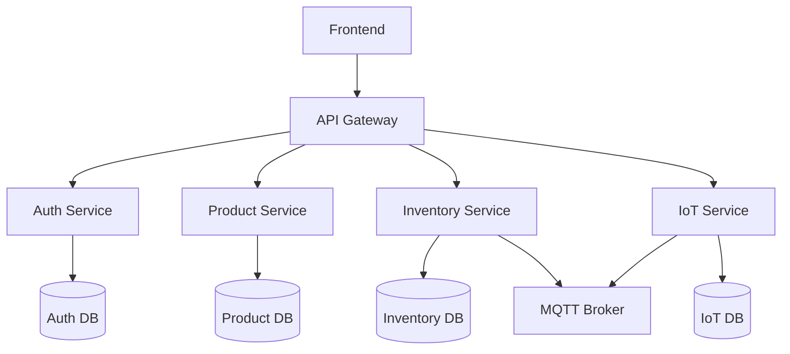

# 🏗️ Guía de Arquitectura: De 3 Capas a Microservicios

Esta guía explica cómo evolucionar de una arquitectura tradicional de 3 capas a una arquitectura de microservicios, usando nuestro sistema de inventario como ejemplo práctico.

## 📚 Tabla de Contenidos

1. [Arquitectura Tradicional de 3 Capas](#arquitectura-tradicional-de-3-capas)
2. [¿Qué son los Microservicios?](#qué-son-los-microservicios)
3. [Comparación: 3 Capas vs Microservicios](#comparación-3-capas-vs-microservicios)
4. [Evolución Gradual](#evolución-gradual)
5. [Implementación en Nuestro Proyecto](#implementación-en-nuestro-proyecto)
6. [Ventajas y Desventajas](#ventajas-y-desventajas)
7. [Cuándo Usar Cada Arquitectura](#cuándo-usar-cada-arquitectura)

## 🏛️ Arquitectura Tradicional de 3 Capas

### Estructura Clásica

```
┌─────────────────────────────────────┐
│           FRONTEND                  │
│     (React, HTML, CSS, JS)          │
│   - Interfaz de usuario             │
│   - Validación de formularios       │
│   - Navegación                      │
└─────────────┬───────────────────────┘
              │ HTTP/REST
┌─────────────▼───────────────────────┐
│           BACKEND                   │
│      (Node.js, Express)             │
│   - Lógica de negocio               │
│   - APIs REST                       │
│   - Autenticación                   │
│   - Validación de datos             │
└─────────────┬───────────────────────┘
              │ SQL
┌─────────────▼───────────────────────┐
│         BASE DE DATOS               │
│        (PostgreSQL)                 │
│   - Almacenamiento de datos         │
│   - Transacciones                   │
│   - Relaciones entre tablas         │
└─────────────────────────────────────┘
```

### Características de 3 Capas

- **Simplicidad**: Todo el código backend en una sola aplicación
- **Desarrollo directo**: Un solo repositorio, un solo deployment
- **Transacciones fáciles**: Una sola base de datos
- **Debugging simple**: Todo en un lugar

### Ejemplo de Código 3 Capas

```javascript
// app.js - Backend monolítico
const express = require('express');
const app = express();

// Todas las rutas en un solo archivo
app.post('/api/auth/login', loginHandler);
app.get('/api/products', getProducts);
app.post('/api/products', createProduct);
app.get('/api/inventory', getInventory);
app.post('/api/inventory/move', moveInventory);

// Una sola conexión a base de datos
const db = require('./database');
```

## 🔄 ¿Qué son los Microservicios?

Los microservicios dividen la aplicación monolítica en **servicios pequeños e independientes**, cada uno con una responsabilidad específica.

### Principios Clave

1. **Single Responsibility**: Cada servicio hace una cosa bien
2. **Independencia**: Pueden desarrollarse y desplegarse por separado
3. **Comunicación por Red**: Servicios se comunican vía HTTP/mensajes
4. **Base de Datos por Servicio**: Cada servicio tiene su propia BD
5. **Ownership**: Equipos diferentes pueden mantener servicios diferentes

## 📊 Comparación: 3 Capas vs Microservicios

| Aspecto | 3 Capas | Microservicios |
|---------|---------|----------------|
| **Complejidad** | Baja | Alta |
| **Deployment** | Una aplicación | Múltiples servicios |
| **Escalabilidad** | Vertical | Horizontal por servicio |
| **Desarrollo** | Un equipo | Múltiples equipos |
| **Testing** | Más simple | Más complejo |
| **Debugging** | Fácil | Requiere herramientas |
| **Transacciones** | ACID simples | Distribuidas complejas |
| **Latencia** | Baja | Más alta (red) |

## 🚀 Evolución Gradual

### Paso 1: Monolito Organizado

Antes de dividir, organiza tu monolito por dominios:

```
backend/
├── auth/
│   ├── controllers/
│   ├── services/
│   └── models/
├── products/
│   ├── controllers/
│   ├── services/
│   └── models/
├── inventory/
│   ├── controllers/
│   ├── services/
│   └── models/
└── shared/
    ├── database/
    ├── middleware/
    └── utils/
```

### Paso 2: Separar por Funcionalidad

Identifica bounded contexts:

```
┌─────────────┐  ┌─────────────┐  ┌─────────────┐
│    AUTH     │  │  PRODUCTS   │  │  INVENTORY  │
│             │  │             │  │             │
│ - Login     │  │ - Catalog   │  │ - Stock     │
│ - Register  │  │ - Categories│  │ - Movements │
│ - Tokens    │  │ - Search    │  │ - Alerts    │
└─────────────┘  └─────────────┘  └─────────────┘
```

### Paso 3: Extraer Primer Servicio

Empieza con el servicio más independiente (ej: Autenticación):

```
┌─────────────────────────────────────┐
│          MONOLITO                   │
│  ┌─────────────┐  ┌─────────────┐   │
│  │  PRODUCTS   │  │  INVENTORY  │   │
│  └─────────────┘  └─────────────┘   │
└─────────────────────────────────────┘
              │
┌─────────────▼───────────────────────┐
│         AUTH SERVICE                │
│        (Independiente)              │
└─────────────────────────────────────┘
```

### Paso 4: Continuar Extrayendo

Gradualmente extrae otros servicios:

```
┌─────────────┐  ┌─────────────┐  ┌─────────────┐
│ AUTH SERVICE│  │PRODUCT SERV.│  │INVENTORY S. │
└─────────────┘  └─────────────┘  └─────────────┘
```

## 🛠️ Implementación en Nuestro Proyecto

### Estructura Simplificada

```
inventory-system/
├── 📁 frontend/                 # Capa de Presentación
│   ├── Dockerfile
│   ├── package.json
│   └── src/
├── 📁 backend/                  # Capa de Servicios
│   ├── 📁 api-gateway/          # Punto de entrada único
│   ├── 📁 auth-service/         # Servicio de autenticación
│   ├── 📁 product-service/      # Servicio de productos
│   ├── 📁 inventory-service/    # Servicio de inventario
│   └── 📁 iot-service/          # Servicio IoT
├── 📁 database/                 # Capa de Datos
│   ├── 📁 init/                 # Scripts de inicialización
│   └── 📁 migrations/           # Migraciones
├── 📁 shared/                   # Recursos compartidos
│   ├── 📁 config/               # Configuraciones
│   └── 📁 utils/                # Utilidades comunes
└── docker-compose.yml           # Orquestación
```

### Flujo de Datos Simplificado



### Comunicación Entre Servicios

#### 1. Comunicación Sincrónica (HTTP)

```javascript
// API Gateway llama a Product Service
const productResponse = await fetch('http://product-service:3000/products/123');
const product = await productResponse.json();
```

#### 2. Comunicación Asincrónica (Eventos)

```javascript
// Inventory Service publica evento
const event = {
  type: 'STOCK_UPDATED',
  productId: 123,
  newStock: 50
};
await eventBus.publish('inventory.events', event);

// Product Service escucha evento
eventBus.subscribe('inventory.events', (event) => {
  if (event.type === 'STOCK_UPDATED') {
    updateProductStock(event.productId, event.newStock);
  }
});
```

## ⚖️ Ventajas y Desventajas

### ✅ Ventajas de Microservicios

1. **Escalabilidad Independiente**
   ```bash
   # Escalar solo el servicio de productos si tiene más carga
   docker-compose up --scale product-service=3
   ```

2. **Tecnologías Diferentes**
   - Auth Service: Node.js + JWT
   - Product Service: Node.js + Elasticsearch
   - Inventory Service: Python + FastAPI
   - IoT Service: Go + MQTT

3. **Equipos Independientes**
   - Team Auth: Frontend + Backend Auth
   - Team Products: Frontend + Backend Products
   - Team Inventory: Backend + IoT

4. **Despliegue Independiente**
   ```bash
   # Actualizar solo auth service sin afectar otros
   docker-compose up -d auth-service
   ```

### ❌ Desventajas de Microservicios

1. **Complejidad de Red**
   ```javascript
   // En monolito: llamada directa
   const user = getUserById(123);
   
   // En microservicios: llamada HTTP
   const user = await fetch('http://auth-service/users/123');
   ```

2. **Transacciones Distribuidas**
   ```javascript
   // Problemático: operación que afecta múltiples servicios
   async function processOrder(order) {
     await updateInventory(order.items);  // Inventory Service
     await chargePayment(order.payment);  // Payment Service
     await sendEmail(order.customer);     // Notification Service
     // ¿Qué pasa si falla uno?
   }
   ```

3. **Debugging Distribuido**
   ```
   Error en Frontend
   ↓
   API Gateway log: "Called product-service"
   ↓
   Product Service log: "Called inventory-service"
   ↓
   Inventory Service log: "Database error"
   ```

## 🎯 Cuándo Usar Cada Arquitectura

### Usa 3 Capas cuando:
- ✅ Equipo pequeño (1-5 desarrolladores)
- ✅ Aplicación simple o mediana
- ✅ Necesitas desarrollo rápido
- ✅ Requisitos de performance altos
- ✅ Transacciones complejas frecuentes

### Usa Microservicios cuando:
- ✅ Equipos múltiples (6+ desarrolladores)
- ✅ Aplicación compleja con dominios distintos
- ✅ Necesitas escalar partes independientemente
- ✅ Tolerancia a complejidad operacional
- ✅ Diferentes tecnologías por servicio

## 🛠️ Migración Práctica

### Estrategia "Strangler Fig"

1. **Mantén el monolito funcionando**
2. **Crea servicios nuevos gradualmente**
3. **Redirige tráfico poco a poco**
4. **Elimina código del monolito cuando el servicio esté estable**

```javascript
// API Gateway con migración gradual
app.get('/api/products', (req, res) => {
  if (FEATURE_FLAGS.useProductService) {
    // Redirigir al nuevo servicio
    return proxy('http://product-service:3000')(req, res);
  } else {
    // Usar código del monolito
    return monolithProductHandler(req, res);
  }
});
```

## 📋 Checklist de Decisión

Antes de migrar a microservicios, pregúntate:

- [ ] ¿Tengo múltiples equipos que trabajarían en paralelo?
- [ ] ¿La aplicación tiene dominios de negocio claramente separados?
- [ ] ¿Necesito escalar diferentes partes independientemente?
- [ ] ¿Mi equipo tiene experiencia con sistemas distribuidos?
- [ ] ¿Puedo invertir en tooling de monitoreo y debugging?
- [ ] ¿Los beneficios superan la complejidad adicional?

## 🎓 Conclusión

Los microservicios no son mejor o peor que los monolitos - son **herramientas diferentes para problemas diferentes**. 

- **Empieza simple** con un monolito bien organizado
- **Evoluciona gradualmente** cuando tengas razones claras
- **No optimices prematuramente** para problemas que no tienes

Nuestro proyecto de inventario está diseñado para mostrar microservicios, pero podrías empezar con un monolito y migrar gradualmente usando los mismos principios de dominio que aplicamos.

## 📚 Recursos Adicionales

- [Martin Fowler - Microservices](https://martinfowler.com/articles/microservices.html)
- [Microservices.io - Patterns](https://microservices.io/patterns/)
- [Building Microservices - Sam Newman](https://www.oreilly.com/library/view/building-microservices/9781491950340/)

---

**Recuerda**: La arquitectura debe servir a tu negocio, no al revés. Empieza simple y evoluciona según necesites.
