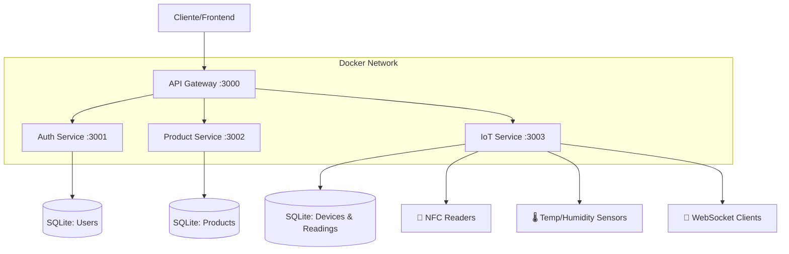
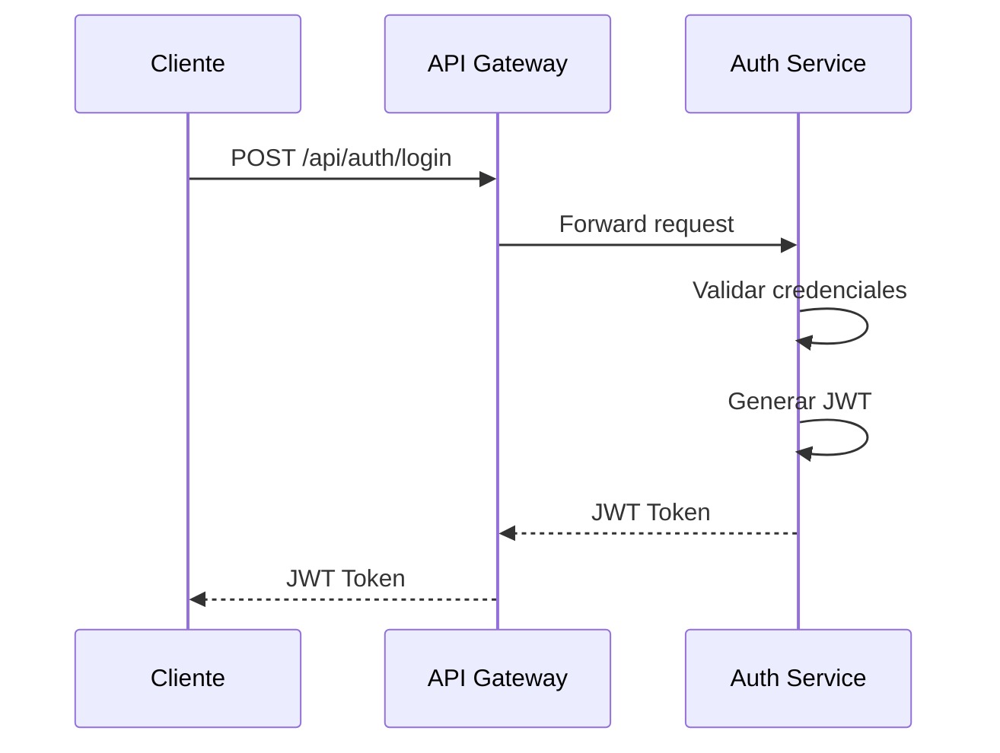
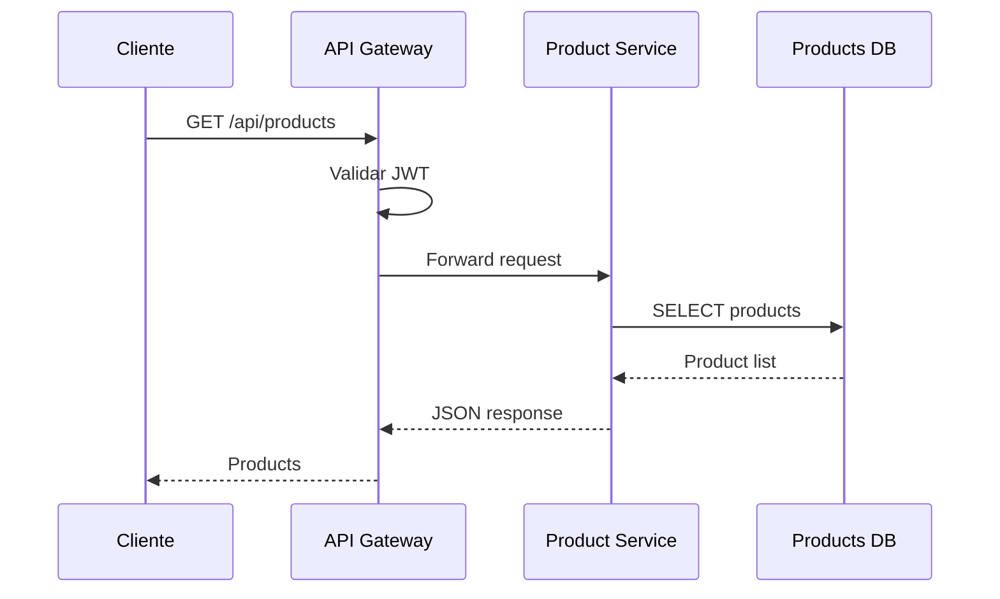
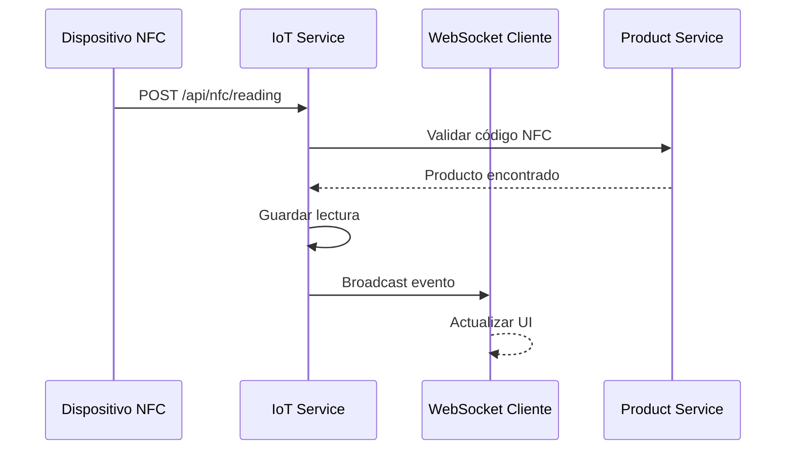

# 🏗️ Guía de Arquitectura - Microservicios e IoT

Esta guía explica la arquitectura del sistema de almacén, diseñada para ser educativa y demostrar conceptos reales de microservicios e IoT.

## 🎯 Principios de Diseño

### 1. **Simplicidad Educativa**
- Cada servicio tiene una responsabilidad clara
- Código comentado línea por línea
- Ejemplos prácticos incluidos
- Documentación exhaustiva

### 2. **Funcionalidad Real**
- Sistema completamente funcional
- Datos de ejemplo realistas
- Simuladores para desarrollo
- APIs siguiendo estándares OpenAPI

### 3. **Escalabilidad**
- Arquitectura preparada para crecer
- Servicios independientes
- Comunicación asíncrona
- Monitoreo incluido

## 🏗️ Arquitectura General



## 🧩 Patrones Arquitectónicos Implementados

### 1. **API Gateway Pattern**
```
🌐 Cliente
     ↓
🚪 API Gateway (Puerto 3000)
     ├── /api/auth/* → Auth Service
     ├── /api/products/* → Product Service
     └── /api/iot/* → IoT Service
```

**Beneficios:**
- ✅ Punto de entrada único
- ✅ Autenticación centralizada
- ✅ Rate limiting
- ✅ Logging unificado

### 2. **Database per Service**
```
🔐 Auth Service → warehouse_auth.db (Users, Sessions)
🛍️ Product Service → warehouse_products.db (Products, Stock)
🌐 IoT Service → warehouse_iot.db (Devices, Readings, Alerts)
```

**Beneficios:**
- ✅ Independencia de datos
- ✅ Escalabilidad por servicio
- ✅ Tolerancia a fallos
- ✅ Tecnologías específicas

### 3. **Event-Driven Architecture**
```
📱 Lectura NFC → Evento → WebSocket → Cliente en tiempo real
🌡️ Sensor → Alerta → WebSocket → Dashboard
```

**Beneficios:**
- ✅ Comunicación asíncrona
- ✅ Desacoplamiento
- ✅ Tiempo real
- ✅ Escalabilidad

## 🔄 Flujos de Comunicación

### 1. **Autenticación**


### 2. **Gestión de Productos**


### 3. **IoT en Tiempo Real**


## 📦 Servicios Detallados

### 🚪 API Gateway
```
Responsabilidades:
├── Enrutamiento de peticiones
├── Autenticación JWT
├── Rate limiting
├── Logging centralizado
├── CORS handling
└── Error handling

Tecnologías:
├── Node.js + Express
├── http-proxy-middleware
├── express-rate-limit
└── Swagger documentation
```

### 🔐 Auth Service
```
Responsabilidades:
├── Registro de usuarios
├── Autenticación (login/logout)
├── Generación de JWT
├── Validación de tokens
└── Gestión de sesiones

Base de Datos:
├── users (id, username, password, email, timestamps)
└── SQLite con bcrypt para passwords

APIs:
├── POST /api/auth/register
├── POST /api/auth/login
├── GET /api/auth/profile
└── GET /api/auth/verify
```

### 🛍️ Product Service
```
Responsabilidades:
├── CRUD completo de productos
├── Búsqueda y filtros
├── Gestión de stock
├── Validaciones de negocio
└── Reportes y estadísticas

Base de Datos:
├── products (id, name, code, category, price, stock, etc.)
└── SQLite con índices optimizados

Características:
├── Paginación
├── Búsqueda full-text
├── Validaciones con Joi
├── Alertas de stock bajo
└── Códigos únicos
```

### 🌐 IoT Service
```
Responsabilidades:
├── Gestión de dispositivos IoT
├── Procesamiento de lecturas NFC
├── Monitoreo de sensores
├── Sistema de alertas
├── WebSockets en tiempo real
└── Simuladores para desarrollo

Base de Datos:
├── devices (id, name, type, device_id, location, config)
├── readings (id, device_id, type, data, timestamp)
└── alerts (id, device_id, type, severity, message, read)

Dispositivos Soportados:
├── NFC Readers
├── Temperature Sensors
├── Humidity Sensors
├── Motion Sensors
└── Light Sensors
```

## 🔗 Comunicación Entre Servicios

### 1. **Síncrona (HTTP)**
```javascript
// Desde IoT Service hacia Product Service
const response = await fetch('http://product-service:3002/api/products/code/LAP-DELL-001');
const product = await response.json();
```

### 2. **Asíncrona (WebSockets)**
```javascript
// Broadcast a todos los clientes conectados
broadcastToClients({
  type: 'nfc_reading',
  data: { nfc_code: 'LAP-DELL-001', product: productData }
});
```

### 3. **Service Discovery**
```yaml
# Docker Compose network
networks:
  warehouse-network:
    driver: bridge

# Los servicios se comunican por nombre
AUTH_SERVICE_URL: http://auth-service:3001
PRODUCT_SERVICE_URL: http://product-service:3002
```

## 🔒 Seguridad

### 1. **Autenticación JWT**
```javascript
// Token Structure
{
  "iss": "warehouse-auth-service",
  "sub": "user_id",
  "exp": 1672531200,
  "iat": 1672444800,
  "username": "admin"
}
```

### 2. **Rate Limiting**
```javascript
// 100 requests por 15 minutos por IP
const limiter = rateLimit({
  windowMs: 15 * 60 * 1000,
  max: 100
});
```

### 3. **Input Validation**
```javascript
// Validación con Joi
const productSchema = Joi.object({
  name: Joi.string().min(2).max(100).required(),
  price: Joi.number().positive().required()
});
```

## 📊 Monitoreo y Observabilidad

### 1. **Health Checks**
```bash
# Cada servicio expone /health
curl http://localhost:3000/health  # Gateway
curl http://localhost:3001/health  # Auth
curl http://localhost:3002/health  # Products
curl http://localhost:3003/health  # IoT
```

### 2. **Logging**
```javascript
// Morgan para HTTP logging
app.use(morgan('combined'));

// Console logging estructurado
console.log('✅ Producto creado:', productData);
```

### 3. **Métricas**
```javascript
// Health check response incluye métricas
{
  "status": "healthy",
  "service": "product-service",
  "stats": {
    "total_products": 150,
    "active_products": 145
  }
}
```

## 🚀 Escalabilidad

### 1. **Horizontal Scaling**
```yaml
# Docker Compose scaling
docker-compose up -d --scale product-service=3
```

### 2. **Load Balancing**
```javascript
// API Gateway puede balancear carga
const productServices = [
  'http://product-service-1:3002',
  'http://product-service-2:3002',
  'http://product-service-3:3002'
];
```

### 3. **Caching**
```javascript
// Redis para cache distribuido (futuro)
const cachedProduct = await redis.get(`product:${productId}`);
```

## 🔮 Evolución Futura

### 1. **Message Brokers**
```
Event Bus (Redis/RabbitMQ)
├── ProductCreated → Update Search Index
├── StockUpdated → Check Alerts
└── NFCRead → Log Activity
```

### 2. **CQRS Pattern**
```
Command Side (Write) → Event Store → Query Side (Read)
```

### 3. **Circuit Breaker**
```javascript
// Hystrix-like pattern
if (serviceDown) {
  return fallbackResponse();
}
```

## 📝 Lecciones Aprendidas

### ✅ **Buenas Prácticas Implementadas:**
1. Un servicio = Una responsabilidad
2. Database per service
3. API Gateway para entrada única
4. Health checks en todos los servicios
5. Documentación OpenAPI
6. Manejo de errores consistente
7. Logging estructurado
8. Configuración por variables de entorno

### ⚠️ **Desafíos Comunes:**
1. **Consistencia de datos**: Eventual consistency
2. **Latencia de red**: Between service calls
3. **Debugging distribuido**: Tracing across services
4. **Gestión de configuración**: Environment variables
5. **Testing**: Integration vs unit tests

### 🎯 **Recomendaciones:**
1. Empezar simple (como este ejemplo)
2. Documentar todo desde el principio
3. Implementar monitoring temprano
4. Usar contenedores desde el día 1
5. Automatizar todo lo posible

---

**Esta arquitectura demuestra cómo construir sistemas distribuidos modernos de manera educativa y práctica.** 🎓
